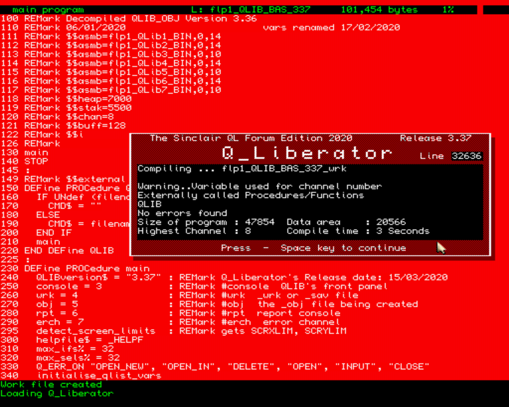
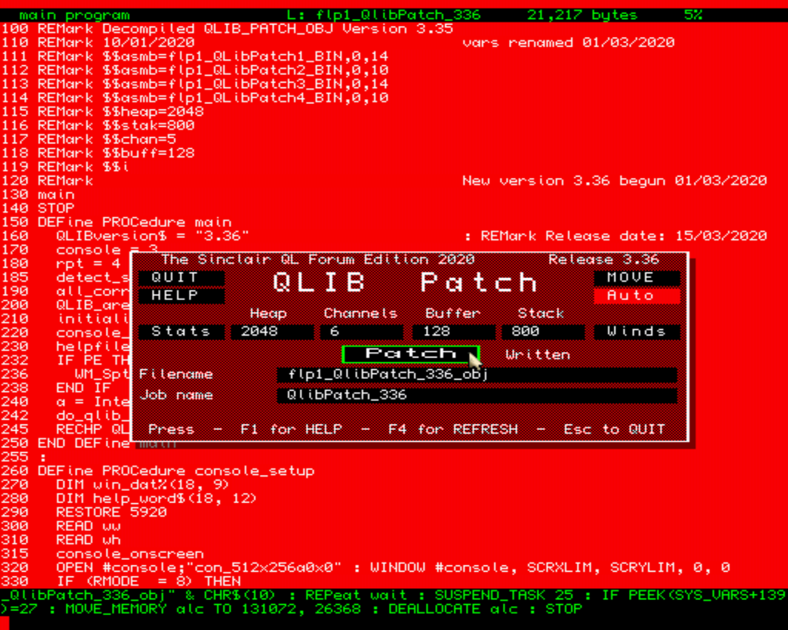

# QLiberator: The Sinclair QL Forum Edition 2020

QLiberator is a SuperBASIC compiler for the Sinclair QL and derivatives.

After 27 years we now have an update to Q_Liberator. The last version was v3.36. There are 4 main additions with this latest v3.37 update:

+ Now able to move QLIB’s front panel around outside of the previous 512x256 limit.

+ Longer filename entries - up to the maximum of 41 chars allowed. This fits into the screen nicely and did not require any change to the front panel.

+ $Hex and %Bin values can now be used. Things like x = $FF + %1010 are now handled correctly.

+ REMarks can now be added anywhere – just as with SuperBASIC. In previous versions, if you added a Remark to the top line of any IF SELect WHEN REPeat FOR structure, it would turn that into a single line construct, and would not then work as intended.

Qlib_Patch has also been updated from v3.35 to v3.36
It is now a bit more user-friendly, with a ”Written” message appearing when “Patch” is clicked.

Q_Liberator was made freeware 3 years ago; Martin Head decompiled the object files back into QL SuperBASIC source, and I did the renaming. With this source code now in our hands, this should pave the way to having some further updates in the future. I have chosen the name, “The Sinclair QL Forum Edition 2020”, as this does seem to be an appropriate name. Will this be acceptable?
The source files are included along with every file needed.
